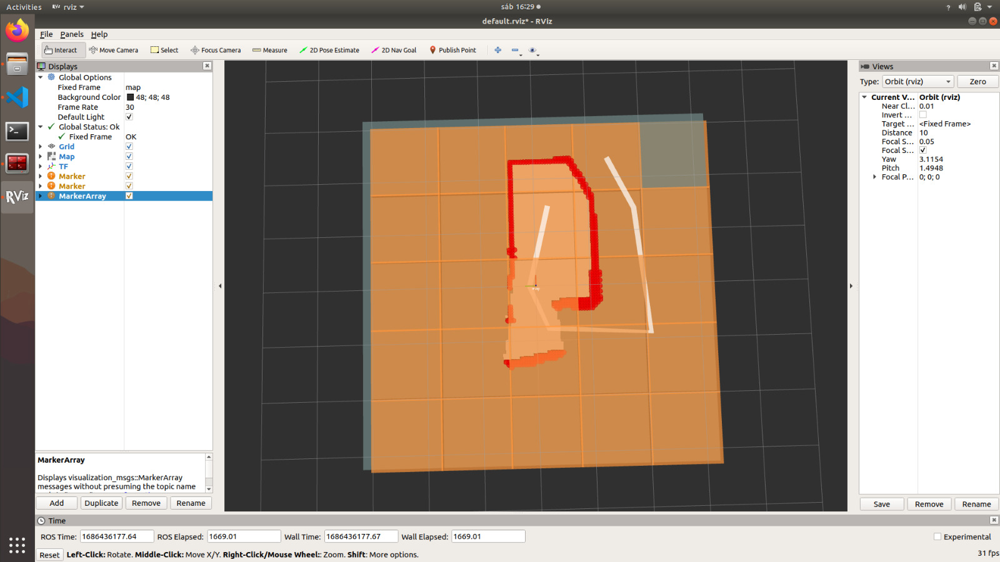
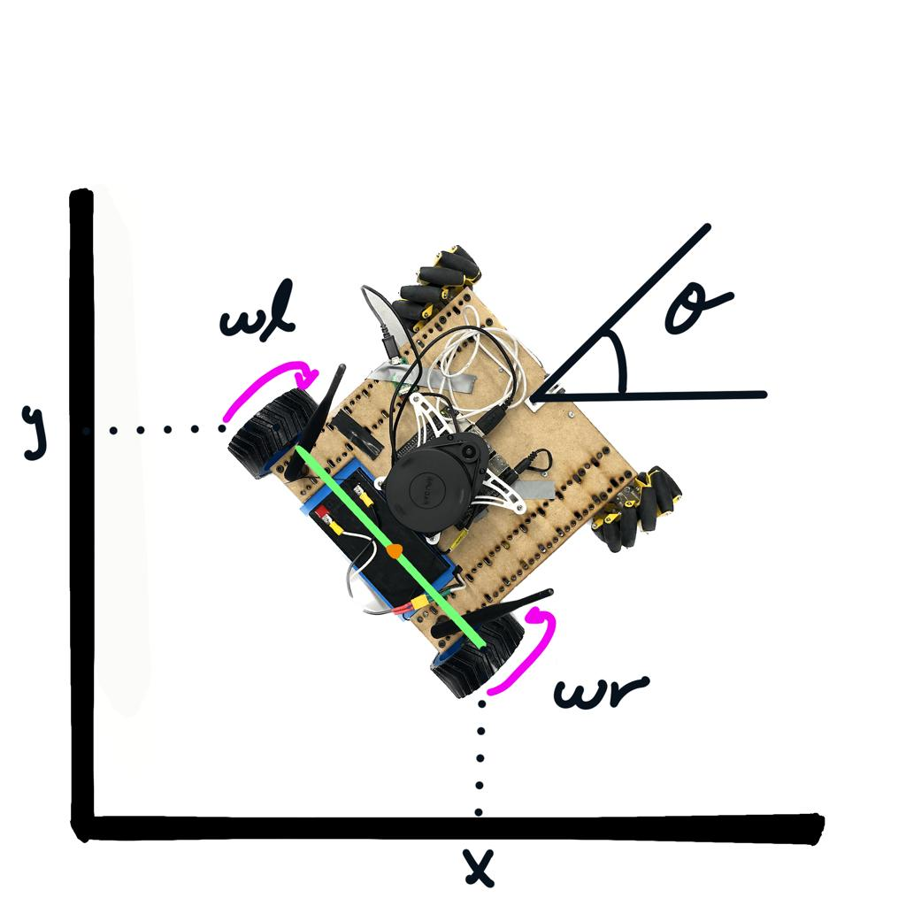

# TheLastOfThem
Our final project in university. The Capybot allows users to map WiFi signals into a 2D space.

## What this is about:
* Build a differential rover
* Generate rich maps about WiFi coverage
* Implement Kalman filters for sensor fusion
* Path planning algoritms:
    * Potential fields
    * RRT
* Low level control is located in the [CapyWheels repo](https://github.com/JorgePerC/CapyWheels.git)
* You can check the full documentation under the $/Doc$ folder

### Video demo:

### Report with solution details:
[Check full report](images/CapybotReport.pdf)

### Authors:
@ Luis Vaca
@ Josue Mojica
@ Jorge Pérez

## Some dependencies: 

To pull the submodules included use:

    git submodule update --init --recursive

Also, you may need to install from APT:

    sudo apt install ros-melodic-packageName

* ros-melodic-depthimage-to-laserscan
* ros-melodic-realsense2-camera (Follow additional instructions for Jetson Devices)
* ros-melodic-rosserial

## BEFORE BUILDING

1. Change the branch on realsense-ros

    cd src/realsense-ros/
    git checkout ros1-legacy

1. You may need to downgrade your OpenCv version depending on the image installed. Check [this](https://answers.ros.org/question/347754/jetson-nano-comes-with-opencv-411-do-i-need-to-downgrade-to-32-for-melodic/) for help
